# Retail Sales SQL Analysis

## Table of Contents

- [Project Overview](#project-overview)
- [Objectives](#objectives)
- [Tool Used](#tool-used)
- [Dataset](#dataset)
- [Exploratory Data Analysis](#exploratory-data-analysis)
- [Data Cleaning](#data-cleaning)
- [Answers To Business Questions](#answers-to-business-questions)
- [Key Findings](#key_findings)
- [Recommendations](#recommendations)
- [Project Documentation](#project-documentation)

 ## Project Overview
This project involved analysing retail sales data using Microsoft SQL Server. The analysis covered exploratory data analysis, data cleaning and SQL queries used to examine sales performance, customer purchasing patterns and transaction activities. The project also involved answering a series of business questions and interpreting the results from the analysis.

## Objectives

The main objectives of the analysis were to:

- Understand the structure and contents of the sales data.
- Check the data for missing values and other data-quality issues.
- Clean the data before carrying out the analysis.
- Examine sales performance across product categories.
- Analyse customer purchasing patterns.
- Identify high-value customers.
- Examine monthly sales patterns.
- Understand transaction activity at different times of the day.

## Tools Used
- Microsoft SQL Server

## Dataset

The dataset contained 2,000 retail sales records.

The available fields included:

- Transaction ID
- Sale Date
- Sale Time
- Customer ID
- Gender
- Age
- Category
- Quantity
- Price per Unit
- COGS
- Total Sale

The original CSV dataset used for the project is no longer available. The project report and screenshots of the SQL queries and results are included in this repository to preserve the work carried out during the analysis.

## Exploratory Data Analysis

Exploratory data analysis (EDA) was carried out before answering the
business questions.

The initial analysis focused on understanding the database structure, examining the available columns, checking the number of records and
checking the data for missing values.

### Database and Table Exploration

The database objects and table structure were examined using `INFORMATION_SCHEMA.TABLES` and `INFORMATION_SCHEMA.COLUMNS`.
-- Explore all object in the database  
SELECT * FROM INFORMATION_SCHEMA.TABLES  
-- Explore all columns in the Database  
SELECT * FROM INFORMATION_SCHEMA.COLUMNS  
WHERE TABLE_NAME = 'SQL - Retail Sales Analysis - SQL - Retail Sales Analysis'  

### Record/Rows Count
-- Count rows  
SELECT COUNT(*) AS TotalRows FROM [SQL - Retail Sales Analysis - SQL - Retail Sales Analysis] ;
The query ran successfully and gave TotalRows = 2000 

## Data Cleaning
The columns were checked for missing values before the analysis. The check identified: 10 missing age records, 3 missing quantity records, 3 missing price-per-unit records, 3 missing COGS records, 3 missing total-sale records

The missing age values were handled by creating an age_flag column to distinguish records where age was known from those where it was missing. Records with missing quantity, price per unit, COGS or total sale were removed because these fields were needed for the sales analysis.

## Answers To Business Questions
The business questions were answered with SQL queries

i.  Retrieve all columns for sales made on '2022-11-05'  
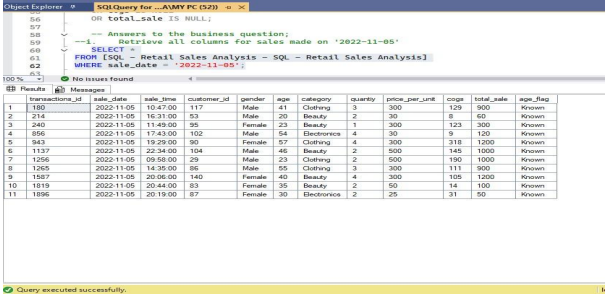

Result: The query returned the sales records that matched the specified date. This was used to filter transactions based on a particular sale date.

ii. Transactions where category is ‘Clothing’ and quantity > 4 in Nov-2022
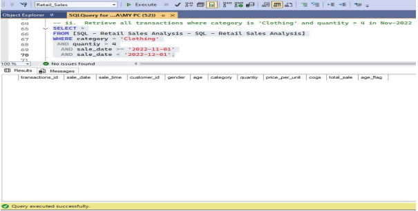

Result: No transaction matched all the conditions in the query.

iii. Calculate total sales for each category.

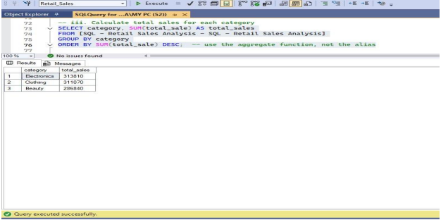

Result: Electronics recorded the highest total sales, followed closely by Clothing. Beauty recorded the lowest total sales among the three
categories.

iv. Find the average age of customers who purchased Beauty products (using age_flag) 
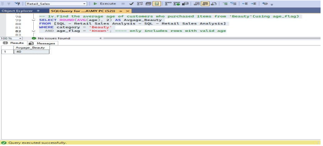

Result: The customers with recorded ages who purchased Beauty products had an average age of 40 years. Records with missing age were excluded from the calculation.

v. Find transactions where total sales were greater than 1,000.
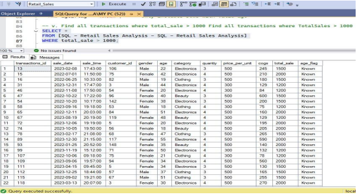

Result: The query identified individual transactions where the recorded total sale was above 1,000.

vi. Find the number of transactions by gender for each product category.
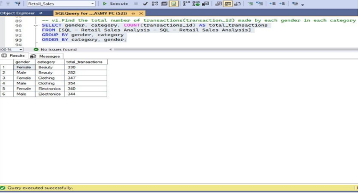

Result: The number of transactions differed across gender and category. Clothing recorded slightly more male transactions, while Beauty
recorded more female transactions in the available data.

vii. Calculate the average sale for each month and find out the best-selling month in each year .
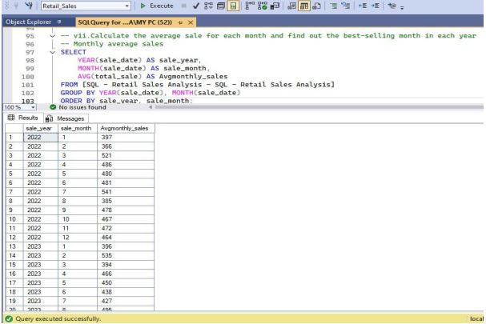
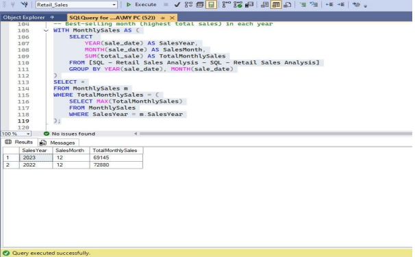

Result: December recorded the highest total sales in both years.

viii. Find the top 5 customers based on highest total sales.
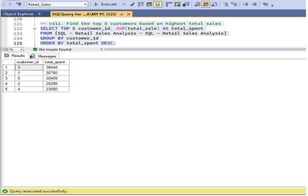

Result: Customer_ID 3 recorded the highest total spending among the five customers identified.

ix. Find the number of unique customers who purchased items from each category.
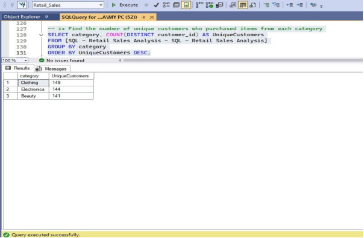

Result: Clothing had the highest number of unique customers, followed closely by Electronics and Beauty.

x. Create each shift and number of orders (Example Morning <12, Afternoon Between 12 & 17, Evening >17).
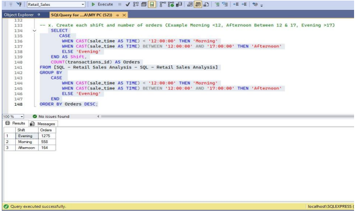

Result: Evening had the highest number of orders, followed by morning and afternoon.

## Key Findings
- The data-quality check found missing values before the analysis. There were 10 missing age records and three missing records each for quantity, price per unit, COGS and total sales.
- Electronics recorded the highest total sales at 313,810, followed closely by Clothing at 311,070, while Beauty recorded the lowest total sales at 286,450.
- Beauty had 624 transactions, compared with 701 for Clothing and 698 for Electronics. Beauty generated a higher average value per transaction but had fewer transactions overall.
- December was the highest-selling month in both years, with total monthly sales of 72,880 in December 2022 and 69,145 in December 2023.
- Customer_Id 3 recorded the highest total spending among the five highest-spending customers at 38,440.
- Clothing had the highest number of unique customers at 145, followed by Electronics at 144 and Beauty at 141.
- There was highest number of orders in the evening, with 1,275 evening orders, compared with 555 in the morning and 164 in the afternoon.

## Recommendations
- Check data quality before analysis.
- Maintain the strong sales performance of Electronics and Clothing through adequate stock, prominent placement and selective promotional offers.
- Increase the number of Beauty transactions through bundle offers and buy-more incentives.
- Prepare for the December increase in sales with sufficient inventory and promotional activities such as holiday-season bundles and gift-oriented product promotions.
- Retain and engage high-spending customers through loyalty rewards and targeted offers.
- Match operations to evening demand by ensuring product availability and sufficient customer-service capacity during the busiest period.

## Project Documentation
[Download SQL Project Documentation](SQL_PROJECT_RETAIL_ANALYSIS.pdf)
